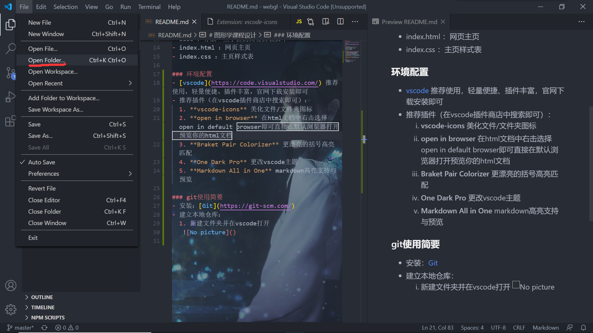
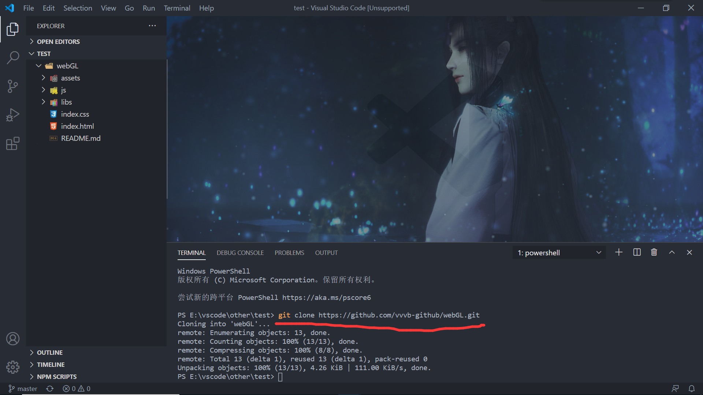
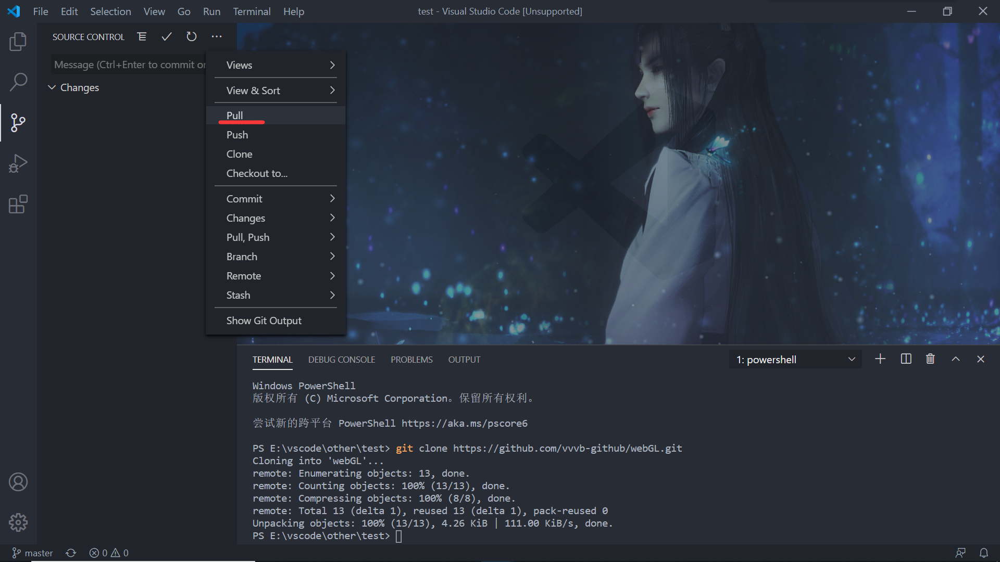
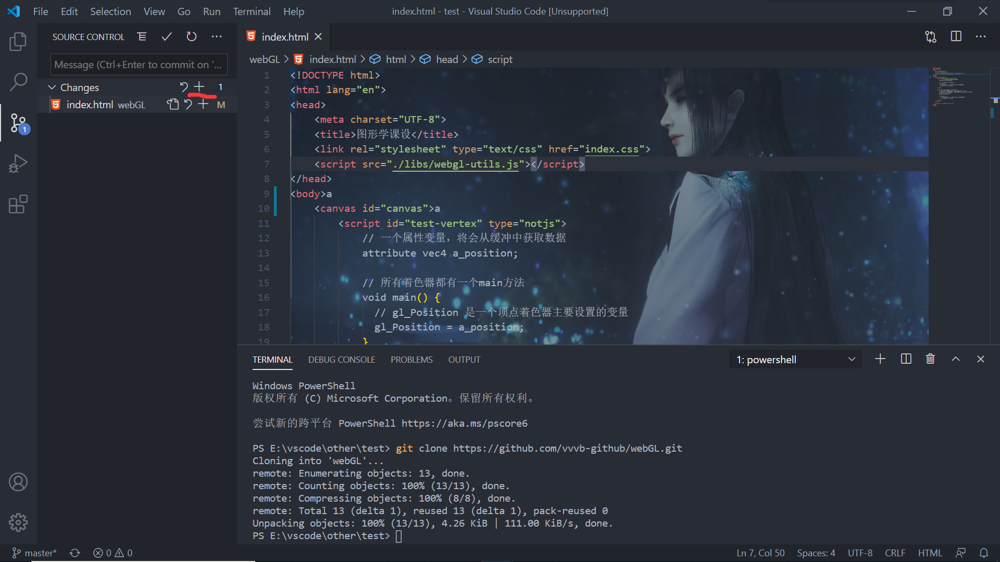
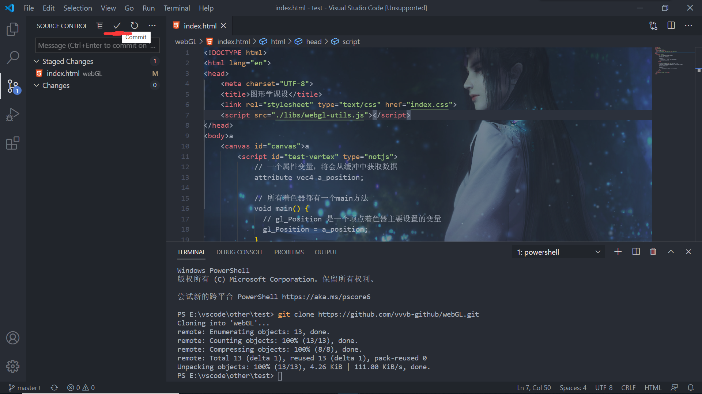
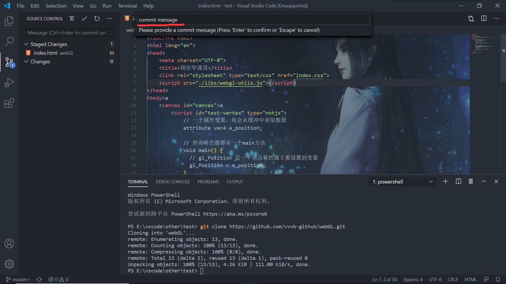
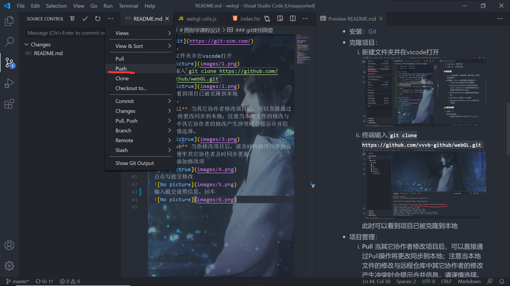

# 图形学课程设计

### github远程仓库
- [webGL](https://github.com/vvvb-github/webGL)

### 参考资源
- [webGL教程](https://webglfundamentals.org/)
- [html/css/javascript教程](https://www.runoob.com/)

### 项目结构说明
- images ：存放图片资源（README中插图）
- assets ：存放外部资源，如音乐、模型等
- js ：存放javascript脚本
- libs ：存放一些手搓的简易封装脚本
- index.html ：网页主页
- index.css ：主页样式表

### 环境配置
- [vscode](https://code.visualstudio.com/) 推荐使用，轻量便捷、插件丰富，官网下载安装即可
- 推荐插件（在vscode插件商店中搜索即可）：
  1. **vscode-icons** 美化文件/文件夹图标
  2. **open in browser** 在html文档中右击选择open in default browser即可直接在默认浏览器打开预览你的html文档
  3. **Braket Pair Colorizer** 更漂亮的括号高亮匹配
  4. **One Dark Pro** 更改vscode主题
  5. **Markdown All in One** markdown高亮支持与预览

### git使用简要
- 安装：[Git](https://git-scm.com/)
- 克隆项目：
  1. 新建文件夹并在vscode打开
   
  2. 终端输入`git clone https://github.com/vvvb-github/webGL.git`
   
  此时可以看到项目已被克隆到本地
- 项目管理：
  1. **Pull** 当其它协作者修改项目后，可以直接通过Pull操作将更改同步到本地；注意当本地文件的修改与远程仓库中其它协作者的修改产生冲突时会提示合并信息，请谨慎选择。
   
  2. **Push** 当你修改项目后，请及时将修改同步到远程仓库，便于其它协作者及时同步更新。
  点击加号添加修改项
  
  点击勾提交修改
  
  输入提交说明信息，回车
  
  提交成功后Push到远程仓库
  
